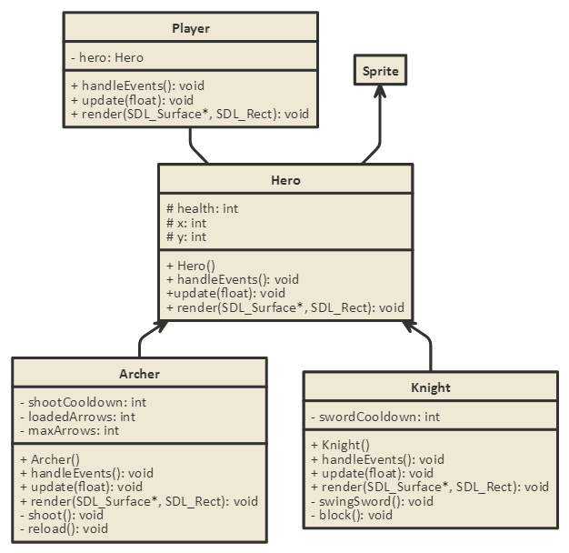

### Devlog 003

***

## Delta times

Because every computer running a game has different specs, we can't know for sure how long each game loop will take. This means that we have to adjust things in the game with how long each loop takes on each machine to make the game run consistently across different machines. To do this, I put a *deltaTime* variable in the game engine that calculates the difference in time between two update calls. Here's the code inside the engine update function:
```c++
currentTime = SDL_GetTicks();
deltaTime = static_cast<float>(currentTime - lastTime)/1000.0;
lastTime = currentTime;
this->currentState->update(deltaTime);
```

With the delta time added to the engine code, we can now use it to call update functions from other classes as well. I added a delta time parameter to the map and tiles update call because it might be used for animation in the future.
```c++
// Map update function
void Map::update(float delta) {
    for(auto const& tile : tileMap) {
        tile.second->update(delta);
    }
}

// Tile update function
void Tile::update(float delta){
    // can be changed to include animated tiles in the future
}
```

***

## Adding the player class

Because I want the player to be able to play as different characters, I'm separating the **Hero** class with the **Player** class. Essentially, the player class contains a hero object and the player class will do all the event handling. After processing incoming events, the Player class decides what methods to call from the hero class, which will vary depending on what hero the player is playing.



Above is a UML diagram of how the Player-Hero class system is going to work. I put in an Archer and Knight class to give an example of how the Hero will be the parent class to all different subclasses.

Here's the header file of the base hero class:
```c++
class Hero : public AnimatedSprite{

public:
    Hero(int, int);

    void update(float);
    void render(SDL_Surface*, SDL_Rect);

    void move(int, float);
    void stopMove(int);
protected:
    int health;
    int speed;
};
```
The implementation for most of the methods are trivial, but the move function is a bit weird. Instead of just taking a flag for direction, it also takes in a float. This is because the hero's movement depends on the delta time. If the game suddenly lag spikes, I still want the hero to move as if the the spike never happened, so instead of updating movement by a fixed value, I added a delta Time calculation to it. Here's what it looks like:
```c++
void Hero::move(int direction, float delta){
    // 0 - up, 1 - right, 2 - down, 3 - left
    if(direction == 0){ y -= speed*delta; }
    if(direction == 1){ x += speed*delta; }
    if(direction == 2){ y += speed*delta; }
    if(direction == 3){ x -= speed*delta; }
}
```

And controlling the hero class, we have the player class:
```c++
class Player : public Entity{

public:
    Player();
    Player(Hero*);

    void handleEvents(SDL_Event);
    void update(float);
    void render(SDL_Surface*, SDL_Rect);
private:
    Hero * hero;

    bool UP, DOWN, LEFT, RIGHT;

    void handleKeyPress(SDL_Keycode);
    void handleKeyRelease(SDL_Keycode);
};
```

The *update* and *render* functions are trivial as well, but the movement controls as well as event handling is a bit different.

***

## Movement

The way I handle movement in my games is a bit unconventional because this is how I used to do it in flash, but it doesn't cost much memory so I like to just stick to my guns. In my player event handler, I detect both *KEYDOWN* events and *KEYUP* events, which correspond to when the player presses a key and releases a key. I also have 4 movement flags to store which keys are pressed, so when the user presses a key, a movement flag will be set to true and the opposite happens when the user releases a key.
```c++
void Player::handleEvents(SDL_Event event){
    // the helper functions just look at the pressed key and change flags accordingly
    if(event.type == SDL_KEYDOWN){
        handleKeyPress(event.key.keysym.sym);
    }else if(event.type == SDL_KEYUP){
        handleKeyRelease(event.key.keysym.sym);
    }
}
```
The update function checks to see which flags are pressed and then moves the hero accordingly. To make the movement smooth, we also take delta time into account so that differences in time between update calls won't affect the movement. I simply added this code into the player update function:
```c++
if(UP){ hero->move(0, delta); }
if(DOWN){ hero->move(2, delta); }
if(LEFT){ hero->move(3, delta); }
if(RIGHT){ hero->move(1, delta); }
```
And that's all the code I have for movement calculations.

***

## Migrate to Visual Studio

The code base at this point is getting quite large, so Atom isn't quite cutting it anymore. Also, the debugging tools built into Visual Studio is going to be really helpful in the future, so it was the best choice for me.

To learn how to use SDL with Visual Studio, there's a good tutorial by [Lazyfoo](http://lazyfoo.net/tutorials/SDL/)