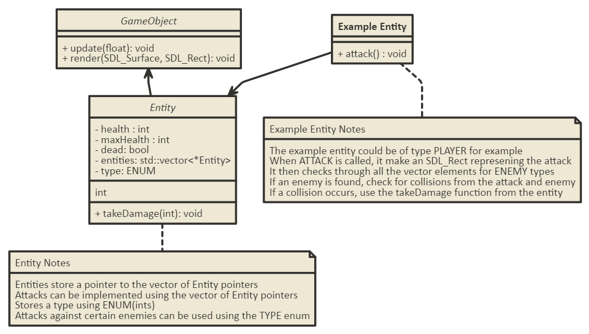

# Devlog 005

***

## Entity Component Systems

So I've been starting to think about how I'm going to implement health and enemies. Naturally, the subject of *Entity Component Systems* comes up. If you don't know what that is, there are a bunch of great resources online that can explain it a lot better than I can.

However, after some good reading I've decided that I won't need to use them. The goal of the game is to have a lot of unique bosses/monsters that share very little logic/mechanics to each other, so using an ECS doesn't make sense because each component would be pretty much unique to an entity, so I might as well just put the code in the entity itself. However, if I find that I'm re-using a lot of code, I might use some mix of ECS in my own code to make things more readable and all that good stuff. In the end, I don't think my game will be large enough that I will have to worry about performance too much, so I'm just rolling with what I think of.

***

## Entity Class Rehaul

So I've been thinking a bit about how I'm going to implement health/attacks and I've decided to do some restructuring in my code. The way I have it set up now, entities will represent pretty much everything in the game. The way I'm going to change it is that **GameObjects** and **Entities** are going to be different classes, where Entity *inherits* from *Gameobjects*. The *GameObject* class will be the base class that represents everything in the game, from the map to players to particle effects to pretty much anything. The *Entity* class will represent *creatures*, basically anything that has health and attacks or something.

Before I jumped into the code, I started with a basic UML diagram. Keep in mind that I am no professional coder, so the UML may be very inconsistent, I'm not sure if it's even UML.



At this point, I'm not worrying about performance because I don't know if I'll get enough content/features in my game to have to worry about performance. If the game calls for it, then I will dive into optimizing things.

***

## Aftermath of Entity class Rehaul

So the actual code didn't really end up looking like my diagram. There are a few main structural things that had to change a lot.

### The sprite and animated Sprite class

Since GameObject and entity are now separated, sprites inherit from *GameObject* instead of *Entity*. The problem this creates, as we will see from my hero class, is that classes that want to inherit from *Entity* can't inherit from AnimatedSprite, or else I'll have to use **Multiple inheritance** and that adds too much complexity for me.

### The Hero class

So since *Hero* inherits from *Entity* now, I can't inherit from *AnimatedSprite* or else I'll have to deal with multiple inheritance, as explained above. My solution is to use *aggregation* / *composition* or whatever that's called. I'm not really good with the terms yet :/ Anyways, I essentially instantiate an *AnimatedSprite* and have a pointer to it in my *Hero* class. That way, whatever I animated sprite attribute I was using before I can just call on the new Animated Sprite object. For a more detailed look into the implementations, I'll link to the commit where I made the changes below.

[The commit log](https://github.com/ianw3214/HeavensEdge/commit/2def9f0d57a78eebea891d375cbb449bdd96b6de)


***

## Virtual Destructor

So it's getting to the point where memory management is getting important. The first step to prevent memory leaks is to add **virtual destructors**. From my understanding, virtual destructors essentially let inherited classes be properly destructed when called from a base memory type. Reading that again, it is not a very explained sentence so I'll just put it in code.
```c++
class Base{

}
class Foo{
    ~Foo(){ std::cout << 'destruct foo'; }
}
Base * foo = new Foo();
// do osme stuff with foo
delete foo;
```
The above code won't execute the destructor of *foo* when it gets destructed, because the *Base* destructor will try to be called since *foo* is of type *Base*. Since there is no destructor for *Base*, the operation counts as an undefined function so the *foo* doesn't get destructed properly and causes a memory leak. When we add a *virtual destructor*, the program knows to look for the method in the subclasses and call the proper destructors. I won't actually show any code because it's quite trivial, but the general formula looks like this:
```c++
virtual ~ClassName();
```
The **~** is just the destructor symbol for those who don't know. We can then implement the function in our .cpp file if we want to do any additional cleanup.

***

## Smart Pointers

Smart pointers are quite crucial in memory management, but after some tinkering I wasn't able to get it to work. Therefore, I'm going to leave this task up to future me, and hopefully it won't be too hard to add after I've put on some more stuff.

Even though I'm not adding it in yet, I'll still try to explain smart pointers a bit. Essentially, a **smart pointer** deallocates the objects that they point to once the object can no longer be referenced. To my knowledge, there are 2 types of smart pointers, the *unique_ptr* and *shared_ptr*. Smart pointers are closely tied to the idea of **Resource Allocation is Initialization**. There are a ton of great articles that can explain RAII probably a lot better than I can, so I'm not really going to bother. In a nutshell, smart pointers can clean up after themselves once they are no longer needed.

[RAII - cppReference](http://en.cppreference.com/w/cpp/language/raii)

***

## Optimization for real

I was trying pretty hard to optimize my check collision algorithm last week but I failed. Somehow looking at it again just gave me the solution so I did it boiiis!! I'll slowly walk you through it.

First, lets recap the problem from before. The *checkCollision* function was running through each tile in the tileMap and checking for collisions against every single tile. It was very inefficient because the player couldn't take up more than 4 spaces of tiles, yet the algorithm was still checking against every single tile. At first glance, the solution is pretty simple: Reduce the amount of tiles that are checked by the algorithm. However, I got stuck last time because I forgot that I was using the index to calculate tile position in checking, so I got confused last time and quit (temporarily). This time, I found out what I was doing wrong and was able to fix it. Yay me!

So, on to the solution. How did I reduce the range? Well I took advantage of a *feature* of c++: dividing and int by and int rounds down if there is a decimal. Therefore, if I take the player x position and y position and divide it with the tile Size, I get the upper left tile that the player is on. Basically, since the player is only as big as a tile, it can only span up to 4 tiles. That means that if I can get the upper left tile, I can get the 3 other tiles as well and therefore I can get the tiles the player span and just check those for collision. So, after I get the upper left tile, I transform the coordinates into an index. For example, if I have an *x position* of 5 and *y position* of 5 and the level was 10 tiles wide, the index would be *5 * 10 + 5* since that would be the index of the tile stored in the collision array. I then calculated the other indices based on that initial index and check against those to determine collision.

Here is my resulting code for the collision function:
```c++
bool Hero::checkCollision(int xpos, int ypos) {
	std::vector<int> checkIndices;			// vector to hold indices of collision map to check
	// get the players left and up most tile box
	int tileX = static_cast<int>(xpos / tileSize);
	int tileY = static_cast<int>(ypos / tileSize);
	// we only have to check 4 boxes because the player spans at most 4 tiles
	// since x and y round down, we know we only have to get the right and bottom tiles
	int targetIndex = tileY * levelWidth + tileX;
	checkIndices.push_back(targetIndex);	// add the current tile always
	// if we aren't at the right most side of the level, add the tile 1 to the right
	if(tileX != levelWidth-1){ checkIndices.push_back(targetIndex + 1); }
	// if we aren't at the bottom, add the bottom 2 tiles
	if ((tileY + 1) * levelWidth < collisionMap.size()) {
		checkIndices.push_back(targetIndex + levelWidth);
		checkIndices.push_back(targetIndex + levelWidth + 1);
	}
	for (unsigned int i = 0; i < checkIndices.size(); i++) {
		int collisionIndex = checkIndices.at(i);
		// for now, check every single tile for a collision
		if (collisionMap.at(collisionIndex) == 1) {	// 1 means it is a collidable tile
			// check the coords of the tile against player position
			int targetX = (collisionIndex % levelWidth) * tileSize;
			int targetY = static_cast<int>(collisionIndex / levelWidth) * tileSize;
			// first check x coordinates
			if (xpos + sprite->getTileWidth() > targetX && xpos < (targetX + tileSize)) {
				// check y coordinates
				if (ypos + sprite->getTileHeight() > targetY && ypos < (targetY + tileSize)) {
					// return true only if both x and y intersect
					return true;
				}
			}
		}
	}
	// return false if no collision happened
	return false;
}
```
Note that even though the function is even larger than before in terms of lines, the efficiency is still improved in most cases because the number of for loops that are run is a lot lower. However, if I for some reason had a level with 4 or even 1 tile, then the changes I made would make the algorithm even slower because the calculations I do beforehand adds a lot more calculations than it does taking out from the for loop. I probably won't be making such small levels though so we're good :)

***

## Basic Enemy Class

Now that the *Entity* class has been restructured and some code has been cleaned up, we can start building up a basic enemy class. The enemy class will look somewhat similar to the hero class, and contains an *AnimatedSprite* as well. For now, we just have a single square representing the enemy so animations haven't been implemented yet.
```c++
// enemy.h

// indludes here
class Enemy : public Entity {
public:
	Enemy();
	Enemy(int, int);
	virtual ~Enemy() {};
	void update(float);
	void render(SDL_Surface*, SDL_Rect);
private:
	int x, y;
	AnimatedSprite * sprite;
	void init();   // one init function for different overloaded constructors
};
```
And the implementations are quite simple as well:
```c++
// enemy.cc

#include "enemy.h"
Enemy::Enemy() : Entity(10, 2) {
	// set default variables
	x = 0;
	y = 0;
	init();
}
Enemy::Enemy(int initX, int initY) : Entity(10, 2), x(initX), y(initY) {
	init();
}
void Enemy::update(float delta) {
	sprite->update(delta);
	sprite->setPos(x, y);
}
void Enemy::render(SDL_Surface * display, SDL_Rect camera) {
	sprite->render(display, camera);
}
void Enemy::init() {
    // the enemy class only has 1 animation so far, so
    // sprite sheet is 1 wide and animation data has 1 entry
	sprite = new AnimatedSprite("assets/enemy.png", 64, 64, 1, false);
	sprite->setAnimationData({ 1 });
}
```
With this, we can make new enemies and add them to the game by pushing them to the vector of *GameObjects* in the level file.

***

## Basic attack

Now that we have a basic enemy structure set up, I added a basic attack function to the hero to see if the Entity structure works. With the way the entity class is designed, it now holds a *pointer* to the *vector of GameObjects*. Hence, when the hero attacks, I can just run a check through the vector and check the types of the gameObjects, and if it is an enemy then the player can deal damage to it. Here's the attack function:
```c++
void Hero::key1Attack() {
    // make sure the pointer is valid before running any operations
    // loop through all entities and deal damage if enemy type
	if (!entityList) { return; }
	for (int i = 0; i < entityList->size(); i++) {
		if (entityList->at(i)->getType() == 2) {
			// cast the type to an entity to access it's functions
			Entity * temp = dynamic_cast<Entity*>(entityList->at(i));
			temp->takeDamage(5);
		}
	}
}
```

***

## Destroying the enemies

Since the entity class was redesigned, the method of removing game objects have changed a little bit. Before, I was using the *Sprite* class to store the remove data, but now the main vector holds objects of *GameObject* type, so I'll have to put the removing data into that class. Here's what it looks like now:
```c++
// includes
class GameObject {
public:
	GameObject();
	void setType(int);
	int getType();
	bool shouldRemove();
	virtual ~GameObject() {};
	virtual void render(SDL_Surface*, SDL_Rect) = 0;
	virtual void update(float) = 0;
protected:
	int TYPE;
	bool REMOVE;
};
```
The implementation is pretty trivial, so I won't post the code here. Now that we have a removal flag in our GameObject class, we can add a loop in the *Level* class that removes the entities if the remove flag is set to true. Here's what the loop looks like.
```c++
for (int i = entities.size() - 1; i>=0 ; i--) {
	if (entities.at(i)->shouldRemove()) {
		GameObject * temp = entities.at(i);
		entities.erase(entities.begin() + i);
		delete temp;
	}
}
```
Notice that I use a temporary pointer to a *GameObject* to store the Object that should be removed. This is because after we remove the pointer from the vector, we still have to deallocate the memory associated with the object otherwise it results in a *memory leak*. If enough of those build up, our program will crash and that's not good, so we store the pointer before removing it from the array so that we can call *delete* to deallocate the memory.

Finally, we have to update the enemy class to actually get removed when it's health drops below 0. Note that I'm putting this functionality in the Enemy class because in the future, I may want to play animations before I delete it or something like that. Every Entity may have a different time when they want to be deleted so I'm putting the details into the classes themselves. This is the new update functon in the enemy class:
```c++
void Enemy::update(float delta) {
	sprite->update(delta);
	sprite->setPos(x, y);
    // set the REMOVE flag to true if health drops to 0
	if (health <= 0) {
		REMOVE = true;
	}
}
```

### Quick note

If we were to use smart pointers in the main vector of GameObjects, we wouldn't have to manually delete the pointer in the loop. After we unset the pointer from the vector, there would be no more references to the Gameobject it points to and the smart pointer would know to clean up automatically. I wasn't quite able to figure out smart pointers last time though, so I'm gonna have to look into it again.

***

## Attack collision

Right now, the attacks hit the enemy no matter where the player is. That doesn't feel right at all, so let's add some collisions! I realized that I would have to change some collision box code because before when I implemented it, I didn't account for both the entity and gameobject being separate classes. I'm not going to go into too much detail about what I changed in the structure of my code, but you can see the changes [here](https://github.com/ianw3214/HeavensEdge/commit/a31b40d1ae41b8add8077a5d4abd231473a3e969).

Basically, I just had to add a collision check in the attack function of the player. The structural changes that I made in the commit were to just make the process of getting the enemy collision boxes a little bit easier. The pseudocode would probably look something like this:
```
function attack():
    for enemy in entities:
        if enemy collides with player:
            enemy.takeDamage(ATTACK_DAMAGE)
```
And that translated into my code looks something like this:
```c++
void Hero::key1Attack() {
	// loop through all entities and deal damage if enemy type
	if (!entityList) { return; }
	for (unsigned int i = 0; i < entityList->size(); i++) {
		if (entityList->at(i)->getType() == 2) {
			// cast the type to an entity to access it's functions
			Entity * temp = dynamic_cast<Entity*>(entityList->at(i));
			// get the enemy collision Rect
			SDL_Rect checkBox = temp->getCollisionRect();
			// check for collisions
			if (checkBox.x <= x + sprite->getTileWidth() && checkBox.x + checkBox.w >= x) {
				if (checkBox.y <= y + sprite->getTileHeight() && checkBox.y + checkBox.h >= y) {
					temp->takeDamage(5);
				}
			}
		}
	}
}
```
And with that implemented, the enemies should now only be damaged when the player is colliding with it.

***

## Testing Utilities

To make testing a little bit easier, I added a hotkey that would generate enemies when I pressed the **f** key. I'm not going to go into too much detail here, but you can see the commit [here](https://github.com/ianw3214/HeavensEdge/commit/16810be016839609564a1e76edf5388f4e72f95d). Essentially, I'm just adding a key press handler in the Level class and adding two new enemies to the entities vector when I press the key. In the future, I would probably randomize the spawn positions of these enemies so I could generate quite a few at the same time. It is quite trivial to implement though, so I'm just going to skip explaining that.

***

## Miscellaneous

### Pausing

I added some small features and fixed some small bugs too. First off, I added a **pause** flag in the Level class so that the game would pause when the player presses space. I decided to put this in early because I don't want to figure out deep into development that I have something that can't work with the pausing functionality and end up having to rewrite everything, so I'm putting it in now. Essentially, it is just a boolean and the *update* function of the Level class now checks if the game is paused before updating the game objects. The new update function looks something like this:
```c++
void Level::update(float delta) {
    // update the game if it is not paused
	if (!pause) {
        // update game elements
	}
}
```

### Quiting

Currently, the only way to quit the game is to click the big old x at the top right of the game window. That's pretty annoying and tedious when I have to test something multiple times, so I added an escape key to quit the game with a single key press. I probably don't want that in the final game but it's nice to have now so why not. I just add another key press event case in the key press handling function that sets a quit flag to true when the escape key is pressed.
```c++
// escape key to quit the game
if (key == SDLK_ESCAPE) {
    nextState = nullptr;
    quit = true;
}
```
Notice that before I set quit to true, I set the *nextState* variable to nullptr. The *nextState* variable holds a pointer to a *State* object, which indicates the next state for the engine to go to when the current one exits. Once the current State quits, the engine will check the nextState and if it sees that it's null, the game will exit. If there is a state, then it will run that state instead. Setting the nextState to nullptr is not necessary, but I put it in as a precaution in case I set the nextState to something else.

### Fixing Map cleanup

So I'm not quite sure how to work with maps, but I'm using it to store pointers so it definitely requires cleanup of some kind. This is the way I was doing it:
```c++
for(int i = 0; i < tileMap.size(); i++){
    delete tileMap.at(i);
}
```
I don't actually know if that was working, there is probably some way to test it but I aint good enough for that. So, I went on **StackOverflow**, the magical site of answers, and discovered the right way to do it:
```c++
for (std::map<int, Tile*>::iterator itr = tileMap.begin(); itr != tileMap.end(); itr++) {
     delete itr->second;
}
```
So yeah, that is fixed now.

### Fixing main

So the big problem that took me a long time to figure out was actually really simple. When I exited the Level class, the engine would call the cleanup code. That means all the entities in the Level were cleaned up and had their memory freed. All of that is fine, but the game kept crashing whenever I tried to quit the game. I put in a lot of time debugging thinking that it was because I didn't handle memory deallocation correctly somewhere, but that was not the problem. The problem lied in my *main* file, because I was still calling the render function after I called the update function. Because I do all deleting entities/memory deallocation in the update function, it meant that the render function was trying to render objects that were already deallocated which obviously wouldn't work. There are definitely better ways to fix this, but my solution was to just put the render call before the update call and *voila*, everything works again.

***

## Thoughts and crackers

Progress has been going along quite well, some of the code still feels very hacked together but that's all part of the process. I might rewrite the whole engine in the future when the code gets messy enough, but for now it'll do. The game still looks really hacky and prototype-y, but hopefully by the end of next week I'll have some nice art to make things looks more polished and some juicy effects to make things look fun!
